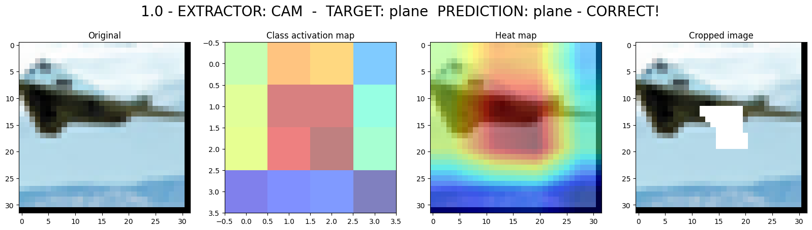
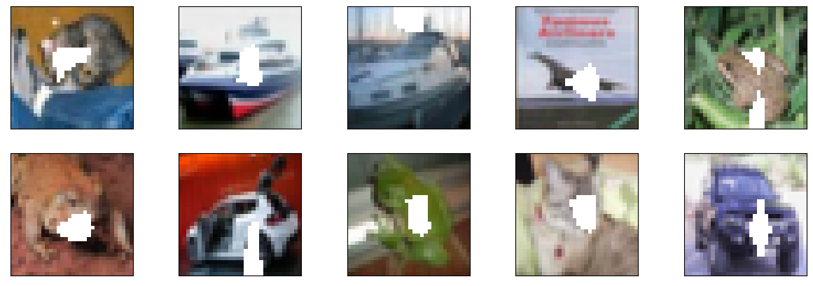
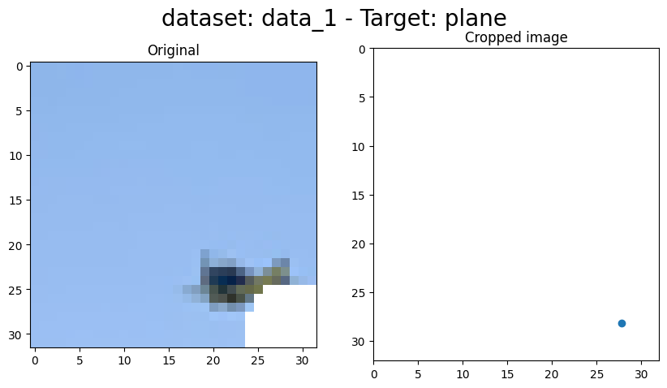

# Counting Salient Features for Image Classification

Image classification can be successfully solved by modern CNNs. However, there
are still a plethora of questions regarding how those models manage to extract
and model general features for large number of classes. A straightforward
strategy is to focus on saliency i.e., the area of the image that has a maximal
response w.r.t. the predicted class. The aim of this project is to complement
that idea by estimating the number of salient regions that common image
classifiers react to and measure the consistency of those regions regarding the
predicted class.

## References
- [Learning Deep Features for Discriminative Localization](https://arxiv.org/pdf/1512.04150.pdf)

## Saliency area detection

## New data set creation

## Centroid computation

